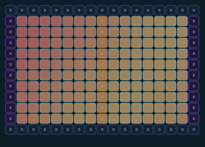
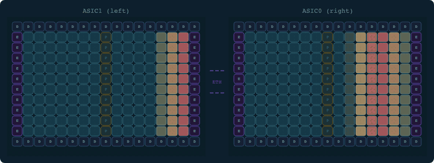
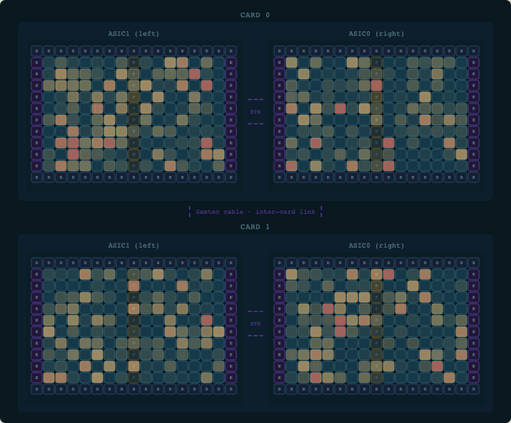
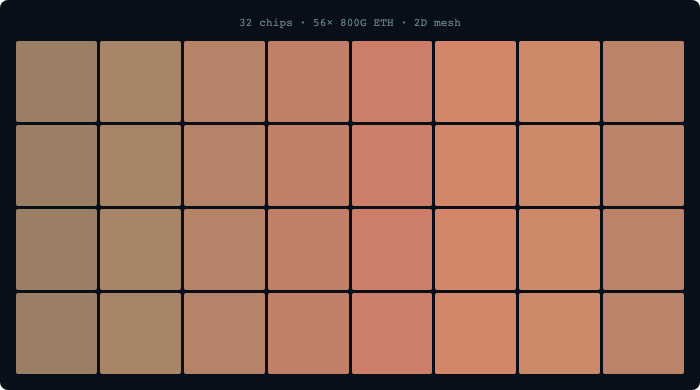
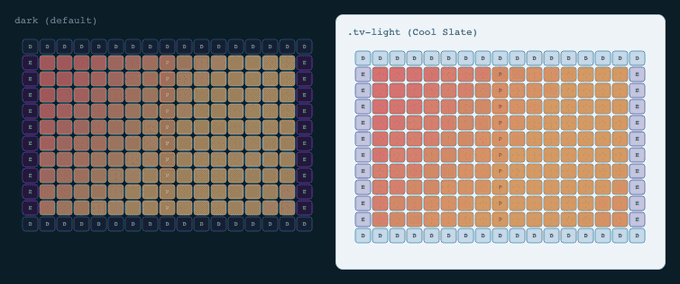
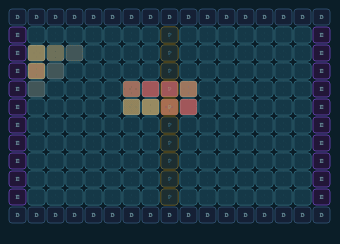
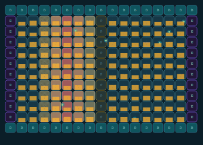

# tensix-viz

Tenstorrent hardware topology visualizer. Single-file, zero-dependency Canvas renderer
from a single Tensix chip up to a Galaxy SuperCluster.

## Preview

| Chip (BH, thinking) | Card (P300c, inference) | System (QB2, agents) |
|---|---|---|
|  |  |  |

| Cluster (Galaxy BH, explore) | Themes (dark + light) | Kernel dispatch |
|---|---|---|
|  |  |  |

| Memory layer (BH, inference) | | |
|---|---|---|
|  | | |

## Quick Start

**CDN (no install):**
```html
<link rel="stylesheet" href="https://cdn.jsdelivr.net/gh/tsingletaryTT/tensix-viz@v1/tensix-viz.css">
<script src="https://cdn.jsdelivr.net/gh/tsingletaryTT/tensix-viz@v1/tensix-viz.js"
        integrity="sha384-[computed at first release build]" crossorigin="anonymous"></script>
```

**npm / GitHub:**
```json
"tensix-viz": "github:tsingletaryTT/tensix-viz#v1"
```
```js
import { TensixViz, CardViz, SystemViz, ClusterViz } from 'tensix-viz'
```

## HTML auto-init

```html
<!-- chip: use a <canvas> element -->
<canvas data-viz="chip" data-config="blackhole" data-mode="idle" width="340" height="240"></canvas>

<!-- card/system/cluster: use a <div> container -->
<div data-viz="card"    data-config="bh-p300c" data-mode="inference"></div>
<div data-viz="system"  data-config="qb2"      data-mode="idle"></div>
<div data-viz="cluster" data-config="bh-galaxy" data-mode="explore"></div>
```

## Theming

Three palettes are available. Apply a CSS class to any widget container — the class can sit on the widget element itself or any ancestor, so you can wrap multiple widgets in a single themed div.

| Class | Behavior |
|---|---|
| *(none)* | **Dark** — default, backward-compatible |
| `tv-light` | **Light** — Cool Slate palette, legible on white documentation pages |
| `tv-auto` | **Auto** — follows OS `prefers-color-scheme` |

```html
<!-- Default dark — existing embeddings need no changes -->
<canvas data-viz="chip" data-config="bh-chip"></canvas>

<!-- Force light theme -->
<div class="tv-light">
  <canvas data-viz="chip" data-config="bh-chip"></canvas>
</div>

<!-- Follow OS preference — light on macOS/Windows light mode, dark otherwise -->
<div class="tv-auto" data-viz="card" data-config="bh-p300c"></div>

<!-- Theme a whole page section at once -->
<section class="tv-light">
  <div data-viz="card"    data-config="bh-p300c"></div>
  <div data-viz="system"  data-config="qb2"></div>
  <div data-viz="cluster" data-config="bh-galaxy"></div>
</section>
```

All four widget classes (TensixViz, CardViz, SystemViz, ClusterViz) respond to these classes. DOM widgets (CardViz, SystemViz, ClusterViz) use CSS custom properties; TensixViz resolves the theme per render frame by walking up the DOM, so theme switches take effect immediately with no extra JavaScript.

## API

All classes share a common interface:

| Method | Description |
|--------|-------------|
| `activate(mode)` | Start continuous animation — see modes table below |
| `reset()` | Stop animation, clear state |
| `highlight(indices)` | Highlight chips/cards/nodes by index array |
| `transitionTo(level, opts)` | Zoom in/out. Returns `Promise` resolving after 300ms |
| `destroy()` | Clean up DOM and animation frames |

### Animation modes

Nine modes are available. All are **visual metaphors** — they suggest the conceptual nature of a workload, not a physically accurate trace of core activation. Real Tenstorrent workloads are dominated by matmuls that keep most or all Tensix cores busy simultaneously regardless of workload type. Modes marked ◆ most closely match what `tt-toplike` would actually show.

| Mode | Pattern | Represents | Hardware reality | DRAM signature (`showMemory`) |
|------|---------|------------|-----------------|-------------------------------|
| `idle` | Quiet random shimmer | Background system activity | ARC firmware + DDR refresh; compute cores mostly clock-gated | 0.05 — near-silent |
| `inference` | Column sweep L→R | Sequential token generation | Matmul tiles distributed across full mesh; batch=1 decode is memory-BW-bound | 0.55 — steady reads (KV cache) |
| `diffusion` | Expanding ring from center | Image denoising timestep | DiT/U-Net = transformer forward passes, same pattern as inference | 0.65 — periodic bursts per denoising step |
| `agents` | Random burst clusters | Async tool-call dispatch | Sustained compute-bound utilisation; "clusters" are logical, not physical | 0.45 — irregular KV cache bursts |
| `explore` | Sinusoidal wave | Particle Life physics field | Custom RISC-V kernels do distribute spatially — closest to spatial truth for Metalium workloads | 0.30 — moderate steady |
| `thinking` ◆ | Sustained full-grid glow | Extended reasoning / CoT | **Most accurate** — long CoT inference is sustained high matmul utilisation across all cores | 0.12 — nearly dark (weights in L1) |
| `prefill` ◆ | Wide fast-moving band | Parallel prompt ingestion | **Close to accurate** — prefill is genuinely compute-bound and uses all cores simultaneously | 0.90 — one large burst then drops |
| `video` | Two phase-offset rings | Temporal video frame denoising | 3D DiT (Wan, SkyReels) = transformer layers, not rings; same as `thinking` in practice | 0.70 — two phase-offset burst channels |
| `batch` ◆ | Three concurrent sweeps | Parallel batched decode | Reasonable abstraction — batched inference does run multiple sequences through the same compute | 0.80 — broad sustained multi-sequence |
| `kernel_dispatch` ◆ | Rectangle of cores lights up via ripple from dispatch origin | Metalium kernel launch: program compiled → NOC multicast to assigned core grid | **Close to accurate** — Metalium dispatches kernels to rectangular Tensix core grids via NOC multicast; multiple kernels can run concurrently on disjoint grids | event-driven spike at dispatch + 0.50 writeback |

For live per-core utilisation data, see [tt-toplike](https://github.com/tenstorrent/tt-toplike).

### TensixViz — single chip

```js
const viz = new TensixViz(canvas, { arch: 'blackhole' | 'wormhole', showMemory: true })
viz.activate('inference')
// Override with live telemetry data
viz.setMemoryStats({ dram_bw: 0.75, l1_fill: 0.60 })
// Legacy lesson API (unchanged)
viz.play([{ step: 'highlight', cores: [[1,1]], color: 'teal', ms: 600 }])
```

### CardViz — 2-chip card (P300c BH or n300 WH)

```js
const viz = new CardViz(container, 'bh-p300c')   // or 'wh-n300'
viz.activate('diffusion')
await viz.transitionTo('chip', { index: 0 })     // zoom into chip 0
await viz.transitionTo('card')                   // zoom back out
```

### SystemViz — multi-card system (QB2, T3000)

```js
const viz = new SystemViz(container, 'qb2')      // or 't3000'
viz.activate('agents')
await viz.transitionTo('card', { index: 0 })
await viz.transitionTo('chip', { card: 0, chip: 1 })
await viz.transitionTo('system')
```

### ClusterViz — server/cluster (Galaxy BH, Galaxy SC)

```js
const viz = new ClusterViz(container, 'bh-galaxy')   // or 'bh-galaxy-sc'
viz.activate('explore')
await viz.transitionTo('server', { index: 0 })
await viz.transitionTo('cluster')
```

## Topology configs

| Name | Description |
|------|-------------|
| `bh-chip` | Blackhole single chip (17×12, 120 Tensix cores) |
| `wh-chip` | Wormhole single chip (10×12, 64 Tensix cores) |
| `bh-p300c` | P300c card (2 BH chips, intra-card ETH links) |
| `wh-n300` | n300 card (2 WH chips, 2 intra-card ETH links) |
| `qb2` | QB2 system (2× P300c = 4 BH chips, Samtec inter-card) |
| `t3000` | T3000 system (4× n300 = 8 WH chips, 2×4 mesh) |
| `bh-galaxy` | Galaxy BH server (32 chips, 4×8 mesh, 56× 800G ETH) |
| `bh-galaxy-sc` | Galaxy SuperCluster (4× Galaxy = 128 chips, 2D torus) |

## Examples

Open `examples/index.html` in a browser — no server required.

## Build

```bash
npm install
npm run build     # produces tensix-viz.js + tensix-viz.esm.js
npm test          # run vitest suite
```

## Migration from tt-vscode-toolkit

If you were using `tensix-viz.js` directly from tt-vscode-toolkit:

1. Replace the file reference with this repo's `tensix-viz.js`
2. All existing `new TensixViz(canvas, {arch})` calls work unchanged
3. Optionally add `CardViz`/`SystemViz`/`ClusterViz` for multi-chip views
